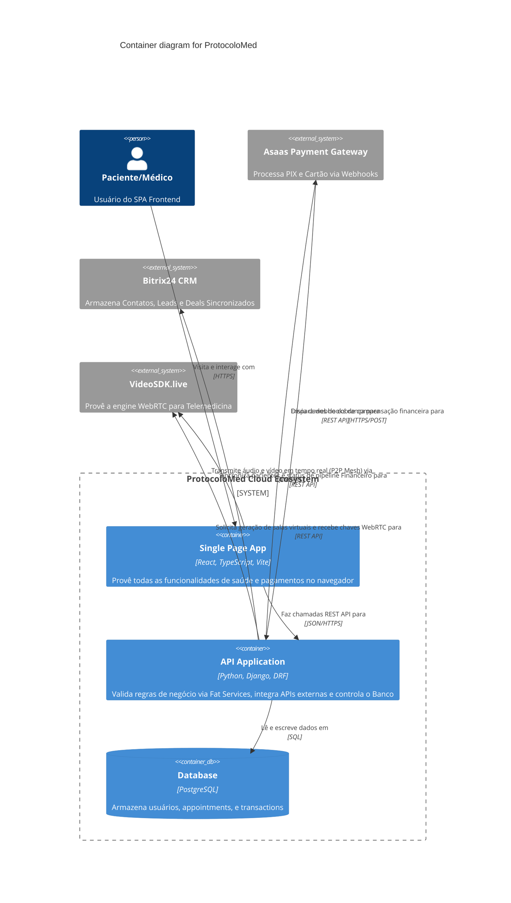
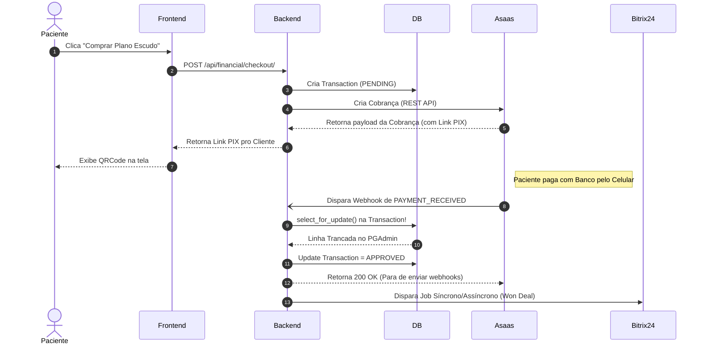

# Arquitetura do Sistema: ProtocoloMed

## Visão Geral (C4 Model - Nível 1: Contexto)
O **ProtocoloMed** é uma plataforma de agendamento de consultas médicas e telemedicina, focada em fornecer uma jornada integrada e fluida tanto para pacientes quanto para médicos, com sincronização em tempo real de contatos, negócios ("Deals") e pagamentos com o CRM Corporativo (Bitrix24).

> 💡 **Nota do Tech Lead:** Todo o design listado neste documento segue estritamente nosso **[Manifesto das 5 Leis Imutáveis](manifesto.md)** (Separação de Serviço, Não uso de *Any*, Otimização atômica). Violá-las acarretará em re-trabalho compulsório.

### Atores Principais
1. **Pacientes:** Acessam o sistema para comprar planos de assinatura, agendar consultas e realizar chamadas de vídeo (Telemedicina).
2. **Médicos:** Acessam para visualizar sua agenda, atender pacientes via chamadas de vídeo e gerenciar seu perfil profissional (CRM).
3. **Administradores / Backoffice:** Acessam o painel administrativo (Django Admin) para gerenciar usuários, transações financeiras e resolver disputas.

### Sistemas Externos (Integrações Core)
O sistema não funciona de forma isolada, ele orquestra processos entre vários microsserviços de terceiros:
*   **Asaas (Gateway de Pagamento):** Processa todos os pagamentos (PIX, Cartão, Boleto). O ProtocoloMed não armazena dados sensíveis de cartão, atuando via webhooks e IDs de referência. Substituiu o antigo Mercado Pago.
*   **Bitrix24 (CRM):** A fonte da verdade para o pipeline comercial. Todo usuário criado no ProtocoloMed vira um *Contato* no Bitrix24. Todo agendamento ou pagamento vira um *Deal* no Bitrix24. O espelhamento é bidirecional (Webhooks do Bitrix24 avisam o ProtocoloMed sobre mudanças de status).
*   **VideoSDK (Motor de Telemedicina):** Provedor da infraestrutura de vídeo (WebRTC) para as consultas virtuais. Substituiu a antiga integração com Daily.co. Fornece URLs, IDs de sala e controle de tokens.

---

## Componentes Técnicos (Nível 2: Containers)

### 1. Frontend (SPA)
*   **Stack:** React, TypeScript, Vite, TailwindCSS.
*   **Gerenciamento de Estado e Cache:** React Query (TanStack Query) para chamadas de API assíncronas e Zustand/Contextos (se aplicável) para estado local leve.
*   **Responsabilidade:** Fornecer interfaces de UI responsivas. Renderizar a sala de vídeo embedded (usando pacotes do provedor de video, VideoSDK). Orquestrar a navegação com `react-router-dom`. Autenticação via tokens JWT armazenados (idealmente de forma segura, como cookies HttpOnly).

### 2. Backend (RESTful API)
*   **Stack:** Python, Django 5.x, Django REST Framework (DRF), Celery (para filas, se configurado), Redis (Cache e Broker).
*   **Padrão Arquitetural Principal:** *Fat Services, Skinny Views* (Service Layer Pattern). Evita usar signals diretamente para integrações externas (preferindo serviços explícitos). A lógica de negócio reside dentro de `apps/nomedoapp/services.py`, mantendo `views.py` e `serializers.py` enxutos.
*   **Autenticação:** JWT (JSON Web Tokens) com Refresh e Access tokens (`djangorestframework-simplejwt`).
*   **Estrutura de Aplicações (`apps/`):**
    *   `accounts`: Gerencia a Autenticação (JWT), Modelos `User`, `Patients`, `Doctors`, e serviços fortemente acoplados com o roteamento para Bitrix (`BitrixService`).
    *   `medical`: Controla o modelo de domínio principal: `Appointments` (Agendamentos), a geração de salas de telemedicina (`VideoSDKService`) e fusos horários.
    *   `financial`: Trata fluxos de pagamento, modelo `Transaction`, lida com os webhooks do gateway (`AsaasService`), faturas e cupons de desconto.
    *   `core`: Funções e utilitários compartilhados, middlewares globais, mixins.
    *   `store`: Gestão do catálogo (Produtos e Planos de assinatura).

### 3. Banco de Dados Relacional
*   **Bancos Utilizados:** PostgreSQL ou MySQL no ambiente Produtivo, e SQLite no ambiente de desenvolvimento local (por padrão no Django, mas recomenda-se espelhar o motor de BD em Dev).
*   **Fluxo de Dados:** Uso restrito das Features ORM do Django. Transações financeiras com `select_for_update` ou blocos atômicos (`@transaction.atomic`) para evitar race-conditions de pagamento duplicado.

---

## Fluxos Críticos de Negócio

### Fluxo de Registro (Onboarding)
1. Paciente submete formulário (Nome, Email, Senha, CPF) -> API Backend cria `User` e `Patient`.
2. Backend (Service Layer) aciona sincronicamente/assincronicamente `BitrixService`.
3. `BitrixService` pesquisa se o email/CPF já existe no CRM. Se não, cria o `Contact`. O `ID_Bitrix` retornado é salvo no BD relacional do ProtocoloMed.

### Fluxo de Aquisição de Plano (Checkout Asaas)
1. Paciente escolhe um plano (ex: Protocolo + Consulta).
2. O Backend gera um `Transcation` com status `PENDING`.
3. Chama a API do `AsaasService` para gerar Link/Pix Copy-Paste ou Processar Cartão Direto (via Tokenização Frontend, dependendo da interface do cartão). Associa o pagamento ao UUID de customer do Asaas, gerando `Asaas_Payment_ID`.
4. Webhook do Asaas é disparado quando o banco compensa o pagamento (Assíncrono).
5. O Webhook do Backend recebe POST de sucesso, busca a `Transaction` usando `@transaction.atomic` e `select_for_update` (Lei SRE), altera o status para `APPROVED`.
6. Concede acesso aos recursos liberados do plano ao usuário (atualiza a role/plan).
7. Aciona-se a criação do *Deal* na fila Won (Sucesso Financeiro) do Bitrix24.

### Fluxo de Agendamento Telemedicina (Medical Service)
1. `medical/services.py`: Após pagamento da respectiva consulta (ou tendo consulta no plano), paciente seleciona médico e horário.
2. Função `book_appointment()` verifica disponibilidade em blocos atômicos de banco de dados.
3. Se liberado, a sala é gerada na API remota: `VideoSDKService.create_room()`.
4. Os identificadores e links da sala são gravados no registro `Appointment`.
5. No FrontEnd, paciente ou médico clica em entrar na sala, onde tokens JWT on-the-fly (`VideoSDKService.generate_token`) validam o join session no iFrame da tela React.

---
## Dívida Técnica Documentada
*Não documentar bugs temporários aqui. Este repositório registra passivos a longo prazo que a equipe optou por não resolver imediatamente por limitações da sprint:*
1. **Bitrix Webhooks x Timeout:** Atualmente chamadas ao CRM são síncronas no flow principal de requests do Django. Dependendo da latência da Rússia, uma tela de cadastro pode ficar presa. O ideal será migrar no futuro 100% de criação de Contacts/Deals para `Celery Tasks` (Brokers assíncronos), caso se torne um gargalo.
2. **Hard-Delete:** `Transaction`s não tem soft-delete (`is_deleted = True`), logo podem violar integridade em logs caso sejam deletados. Recomenda-se nunca apagar transações no django admin, sempre alterar status para Cancelled.
