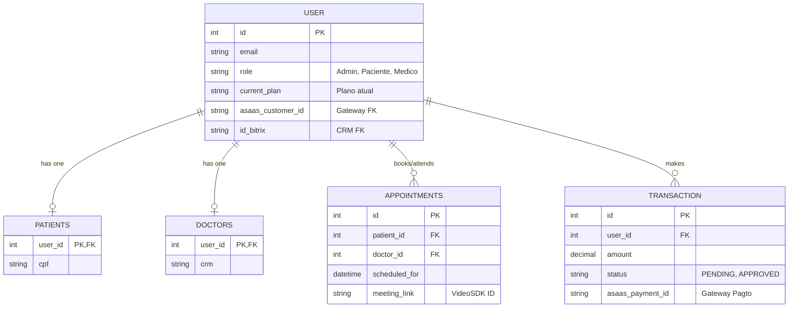

# Estrutura do Banco de Dados

## Regras de Ouro
Estas regras foram definidas pelo Tech Lead ("God Mode") e devem ser estritamente seguidas ao modificar os modelos do Django (`models.py`):

1. **Nunca use UUID como chave de busca sem Indexação:** Se o campo interage com sistemas externos (ex: `asaas_payment_id`), certifique-se de que ele possua constraints ou index arrays se frequentemente buscado.
2. **NUNCA apague transações (Hard Delete):** O app financeiro e médico requerem rastreabilidade de negócio. Use cancelamentos via enum `Transaction.Status.CANCELLED`. O mesmo vale para Appointments.
3. **Limpeza Contínua (Sem Lixo):** Colunas obsoletas (como integrações removidas de provedores antigos como Mercado Pago) devem ser removidas em scripts (como o `cleanup_db.py`) e migrações oficiais antes de ir para Produção. 

## Diagrama Entidade-Relacionamento (Core ERD)

Abaixo representamos as intersecções centrais do ecossistema. O Banco de Dados é PostgreSQL-compliant.



## Regras de Ouro SRE (Site Reliability Engineering)

### 1. `accounts.User` (Tabela Base Central)
*   Estende o usuário nativo do Django (`AbstractUser`).
*   Campos base para Autenticação (Email/Senha).
*   Controles de Acesso customizados: `role` (Admin, Medico, Paciente), `current_plan` (Plano de Assinatura global).
*   *Foreign Keys Principais:* 
    *   `id_bitrix`: Liga o user a um Contato no CRM.
    *   `asaas_customer_id`: Liga o user a um Customer no Gateway de Pagamentos.

### 2. `accounts.Patients` e `accounts.Doctors`
*   Agem como expansão de perfil via ligação OneToOne (`OneToOneField`) com a tabela central `User`.
*   Isolam os dados vitais para os escopos específicos. `Patients` salva altura, peso (dados fixos) enquanto `Doctors` salva `crm`, `specialty` etc.

### 3. `medical.Appointments`
*   O coração agendador. 
*   Liga 1 paciente a 1 médico numa unidade de espaço-tempo baseada no model de Horário.
*   **Gestão de Estado na Nuvem:** Contém os ponteiros temporários de Sala de Reunião: `meeting_link` (A referencia oficial da sala no provedor `VideoSDK`). Como a sessão de vídeo morre após a consulta, este link atua apenas como âncora histórica.

### 4. `financial.Transaction`
*   Rastreia *toda* unidade monetária em transição.
*   *Workflow:* PENDING -> APPROVED | REJECTED | CANCELLED
*   Referencia o pacote (`Plan`) comprado e o ponteiro externo: `asaas_payment_id`. 
*   **Alerta Transacional 🚨 ([Lei 4: Integridade](../manifesto.md)):** Só modifique o status de uma `Transaction` dentro de um Service usando blocos atômicos `@transaction.atomic`. 

#### Padrão de Codificação Exigido (Concurrency Control)
Para evitar que dois webhooks chegando ao mesmo tempo aprovem a mesma transação (Dando saldo duplicado ao cliente), o Backend **DEVE** travar a linha no PostgreSQL durante o update:

```python
from django.db import transaction

def approve_payment(asaas_payment_id):
    with transaction.atomic():
        # select_for_update trava a linha até o final do bloco with
        trans = Transaction.objects.select_for_update().get(asaas_payment_id=asaas_payment_id)
        
        if trans.status == Transaction.Status.APPROVED:
            return  # Idempotência: Já estava aprovado antes do lock levantar
            
        trans.status = Transaction.Status.APPROVED
        trans.save()
        
        # Só libera benefício (Bitrix/Plan) APÓS o save ser efetivado
        trigger_benefits(trans)
```

---

## Limpezas Históricas
*   **Março 2026:** Campos `mercado_pago_id`, `customer_id_mp`, `mp_metadata` removidos. Focado 100% no Asaas Gateway.
*   **Março 2026:** Campos de salas da infraestrutura antiga (Daily.co) (`daily_room_name` e tokens) removidos. `meeting_link` agora armazena os UUIDs universais da conferência para o component VideoSDK.
